# College Student Management System

A modern web application for managing college student records with a clean, responsive UI and powerful features.

## Features

- ✅ **Student CRUD Operations** - Create, Read, Update, and Delete student records
- ✅ **Multi-Step Form** - Organized form with step-by-step data entry
- ✅ **Draft Auto-Save** - Automatically saves form progress to prevent data loss
- ✅ **Search & Filter** - Search students by name and filter by course, gender, hobby, status
- ✅ **Multiple Views** - Switch between table and card views
- ✅ **Sorting** - Sort students by name, age, admission date
- ✅ **Dashboard Analytics** - View statistics and insights about students
- ✅ **Responsive Design** - Works seamlessly on desktop, tablet, and mobile devices
- ✅ **Dark/Light Theme** - Theme support with system preference detection
- ✅ **Data Persistence** - All data is stored locally using local storage
- ✅ **Soft Delete & Restore** - Delete students with undo/restore option from the list or view page

## Screenshots

| Dashboard (Light) | Dashboard (Dark) |
|:----------------:|:----------------:|
| 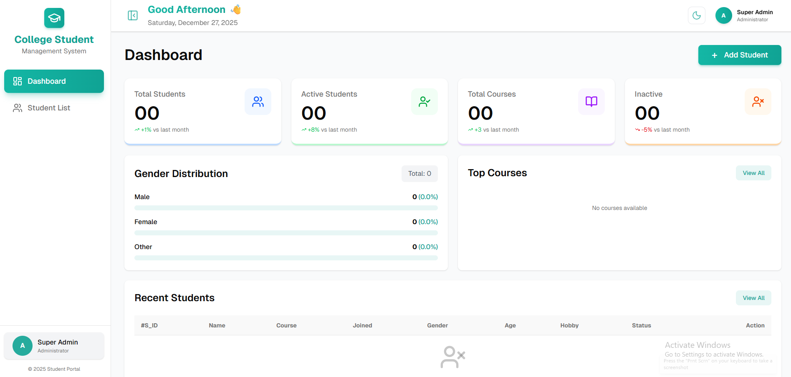 | 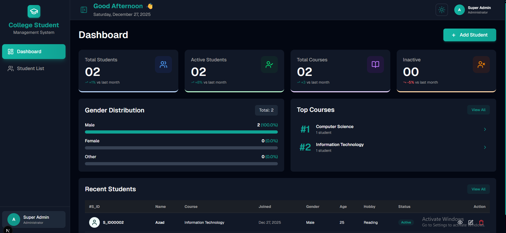 |

| Student List Table | Student List Table (Dark) |
|:-----------------:|:-----------------------:|
| 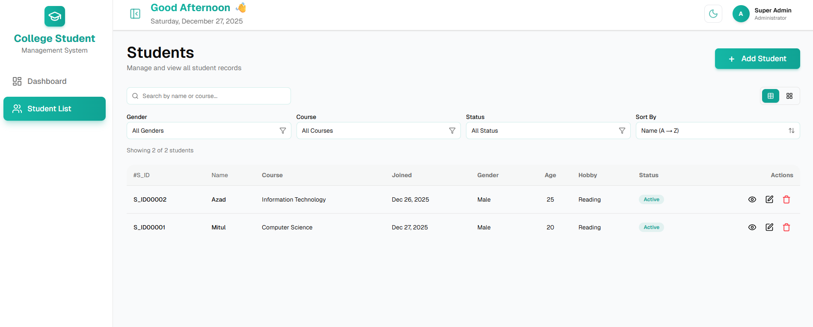 | 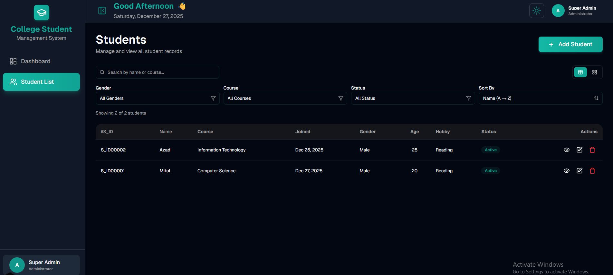 |

| Student List Grid | Student List Grid (Dark) |
|:----------------:|:----------------------:|
| 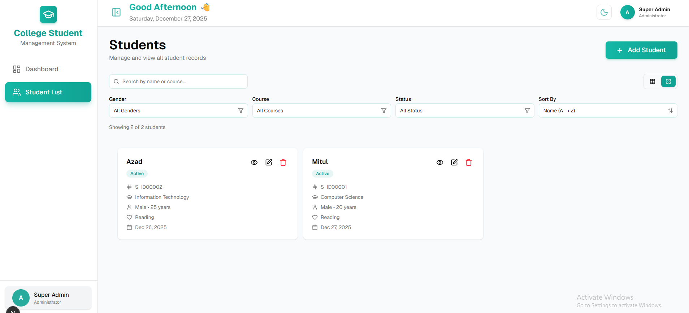 | 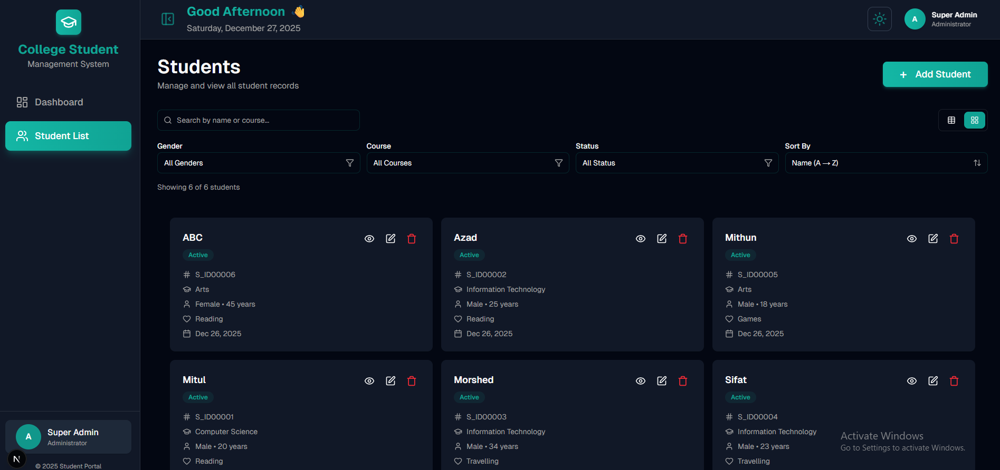 |

| Filter | Add Student (Step 1) | Add Student (Step 2) | Add Student (Step 3) |
|:------:|:--------------------:|:--------------------:|:--------------------:|
| 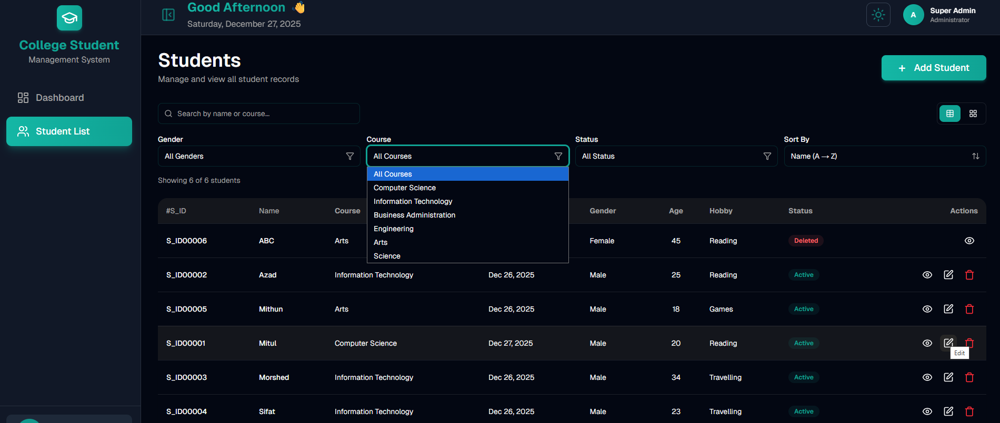 | 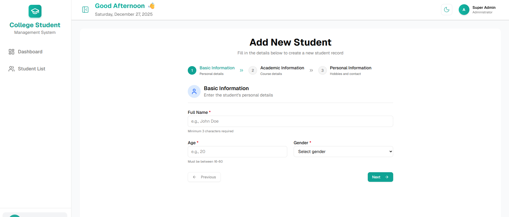 | 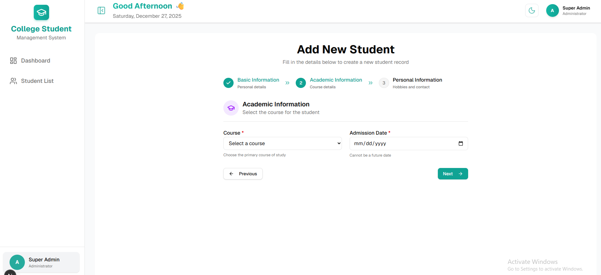 | 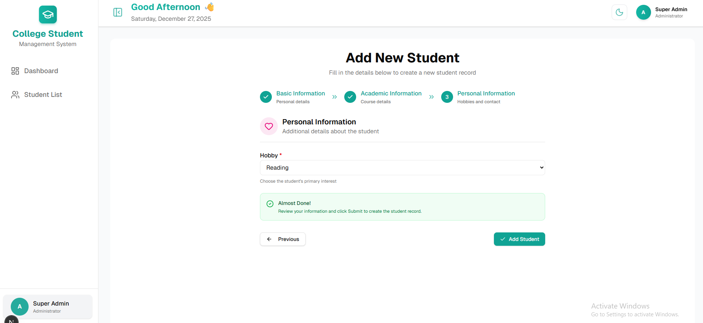 |

| Edit Student (Dark) | Student View | Student View (Restore, Dark) | Delete Warning |
|:-------------------:|:------------:|:---------------------------:|:--------------:|
| 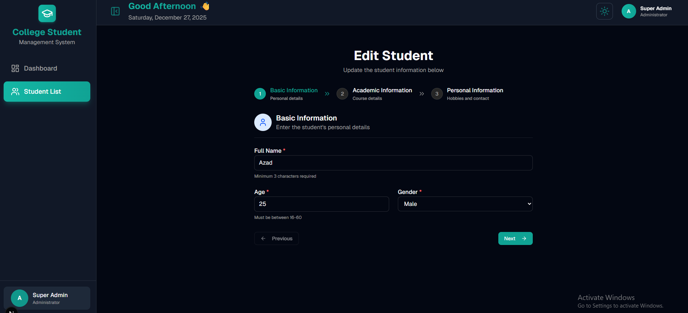 | 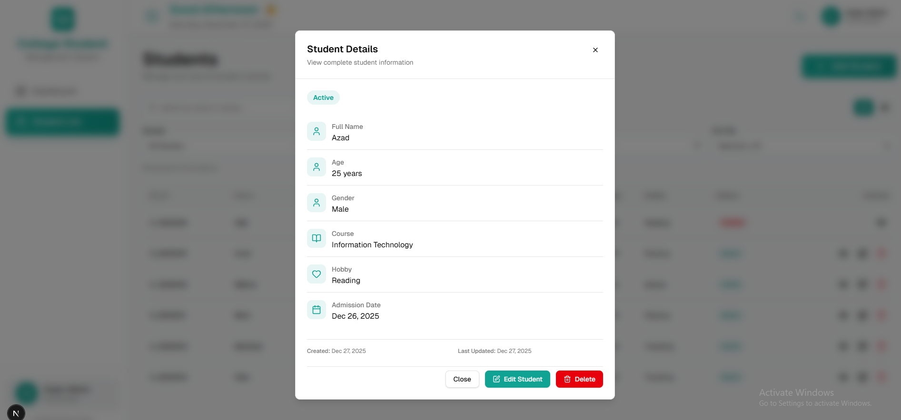 | 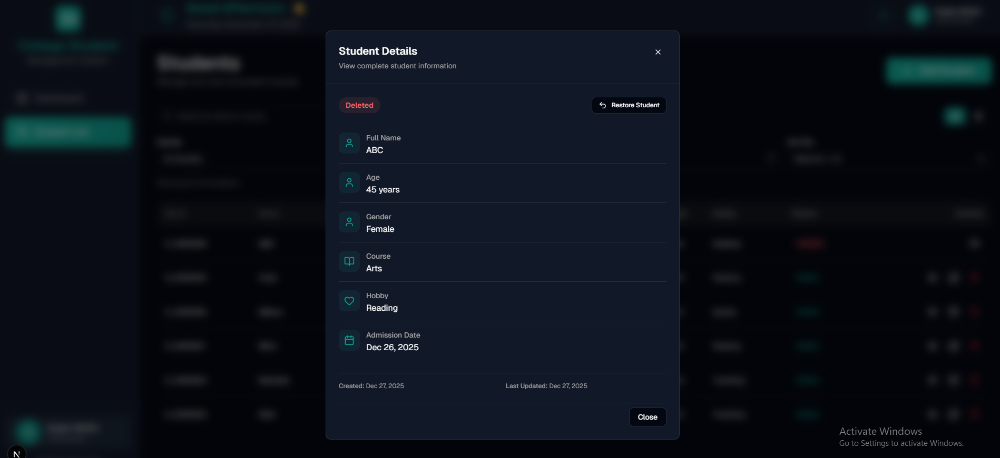 | 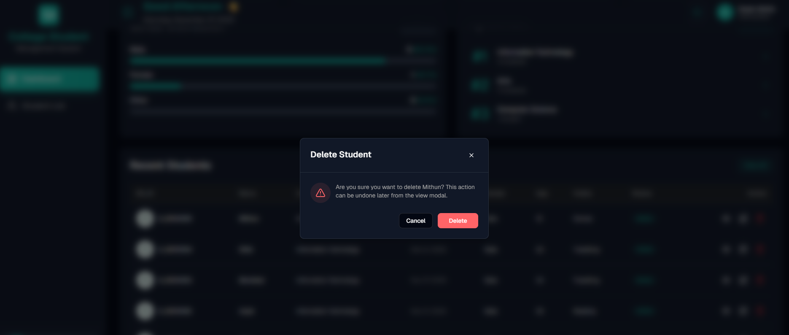 |

**Mobile Views**

| Add Student (Mobile) | Dashboard (Mobile) | Dashboard (Mobile, Light) | Student List (Mobile) |
|:-------------------:|:------------------:|:------------------------:|:---------------------:|
| 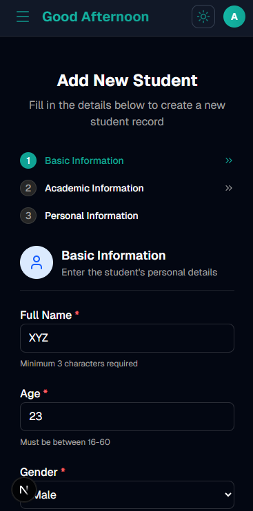 | 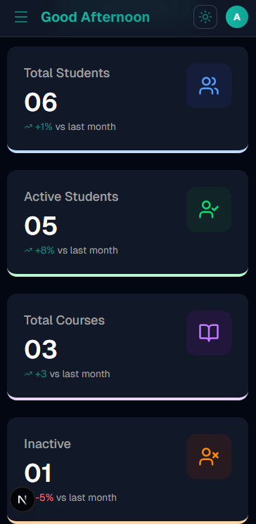 | 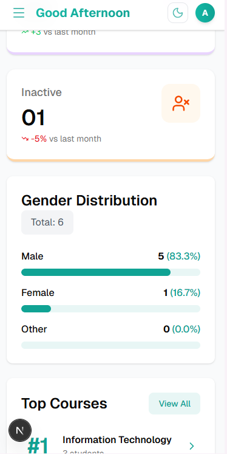 | 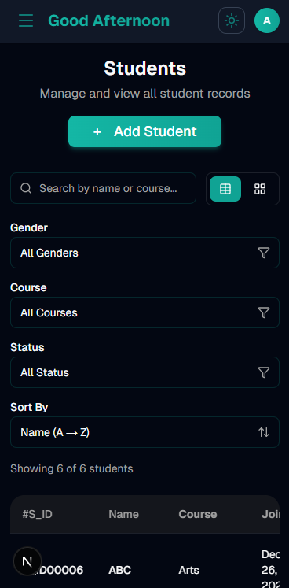 |

---

## Setup Instructions

### Prerequisites

- Node.js 18+ installed on your system
- npm, yarn, pnpm, or bun package manager

### Installation

1. **Clone the repository**
   ```bash
   git clone https://github.com/mdmitulhossen/Assignment-College-Student-Management-System.git
   cd Assignment-College-Student-Management-System
   ```

2. **Install dependencies**
   ```bash
   npm install
   # or
   yarn install
   # or
   pnpm install
   ```

3. **Run the development server**
   ```bash
   npm run dev
   # or
   yarn dev
   # or
   pnpm dev
   ```

4. **Open your browser**
   
   Navigate to [http://localhost:3000](http://localhost:3000) to see the application.

### Build for Production

```bash
npm run build
npm start
```

## Tech Stack Used

### Frontend Framework
- **Next.js 15** - React framework with App Router
- **React 19** - UI library
- **TypeScript** - Type-safe JavaScript

### Styling
- **Tailwind CSS** - Utility-first CSS framework
- **shadcn/ui** - Re-usable component library
- **tw-animate-css** - Animation utilities

### State Management
- **Zustand** - Lightweight state management with persistence middleware

### Form Management
- **React Hook Form** - Performant form handling
- **Zod** - Schema validation

### UI Components & Icons
- **Lucide React** - Beautiful & consistent icon pack

### Code Quality
- **ESLint** - Code linting
- **TypeScript** - Static type checking

## Project Structure

```
src/
├── app/                    # Next.js app router pages
├── components/             # React components
│   ├── dashboard/         # Dashboard-specific components
│   ├── students/          # Student management components
│   ├── ui/                # Reusable UI components (shadcn/ui)
│   └── ...
├── hooks/                 # Custom React hooks
├── lib/                   # Utility functions and constants
│   ├── schemas/          # Zod validation schemas
│   ├── utils/            # Helper functions
│   └── constants/        # Application constants
└── store/                # Zustand state management
```

## Assumptions Made

### Data Storage
- All student data is stored in **browser's localStorage** using Zustand persist middleware
- No backend or database is required
- Data persists across browser sessions but is device-specific

### Student ID Generation
- Student IDs are auto-generated in the format `S_ID00001`, `S_ID00002`, etc.
- IDs are sequential and unique within the local storage
- IDs cannot be manually edited by users

### Form Validation
- **Age**: Must be between 16 and 60 years
- **Name**: Minimum 3 characters, maximum 100 characters
- **Admission Date**: Cannot be in the future
- **Course**: Required field, free text input
- **Gender**: Options - Male, Female, Other
- **Hobby**: Options - Reading, Travelling, Movies, Games

### Draft Functionality
- Form drafts are auto-saved every 500ms while typing
- Drafts are only saved for **new student creation** (add mode)
- Edit mode does not use draft functionality to prevent conflicts
- Drafts are automatically cleared after successful submission
- Only one draft is maintained at a time

### Student Status
- Students have two statuses: **Active** and **Deleted**
- Deleted students are soft-deleted (not permanently removed)
- Deleted students can be restored
- Filters allow viewing active, deleted, or all students

### UI/UX Assumptions
- The application is designed for single-user use (no authentication)
- No role-based access control is implemented
- The sidebar can be collapsed/expanded for better space utilization
- Theme preference is stored in localStorage


## Available Scripts

- `npm run dev` - Start development server
- `npm run build` - Build for production
- `npm start` - Start production server
- `npm run lint` - Run ESLint for code quality


## License

This project is developed as an assignment for educational purposes.

## Author

**Md Mitul Hossen**  
[GitHub](https://github.com/mdmitulhossen)
